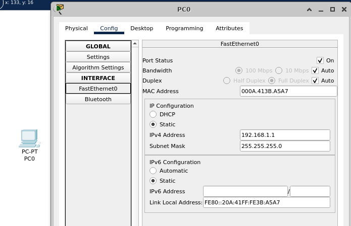
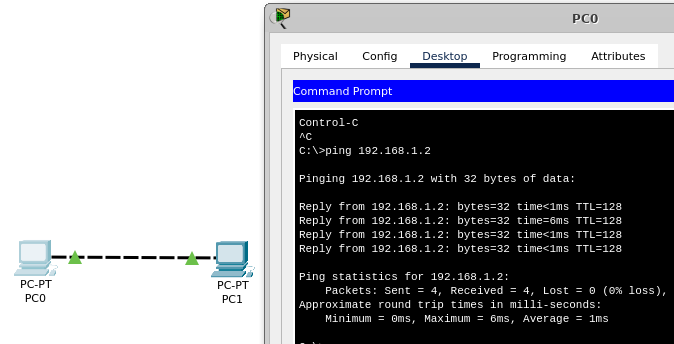
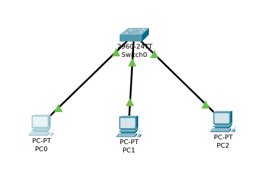
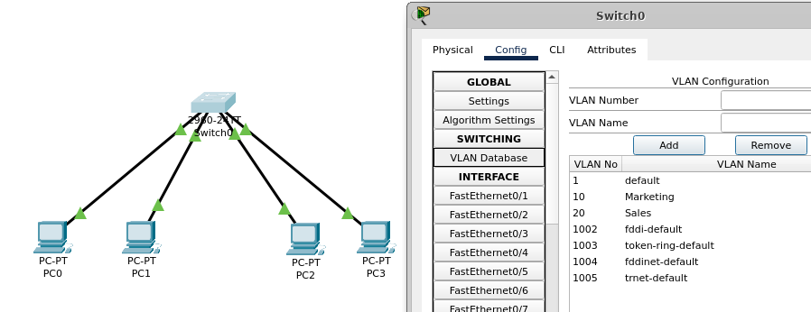
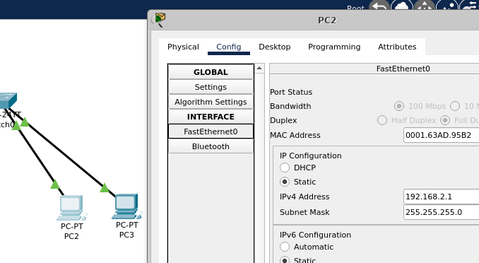
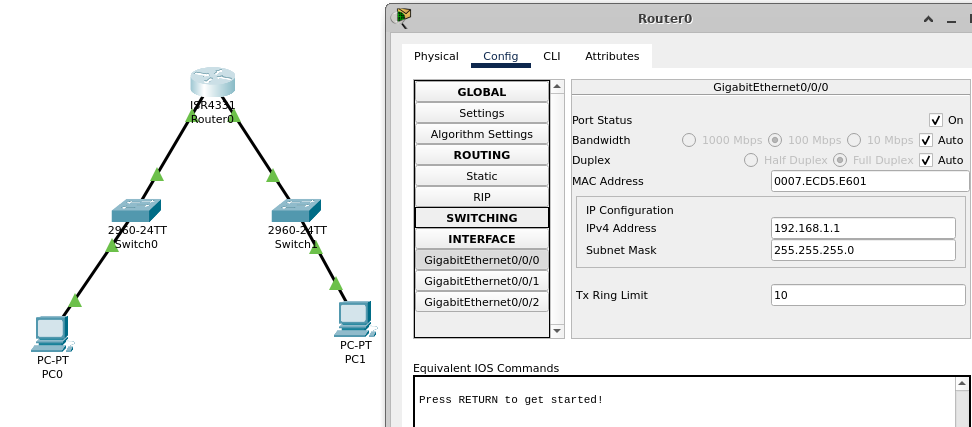

# Configurer un ordinateur
- Configurer son adresse IP
- Entrer dans le terminal de commande
- Voir l'adresse IP

# Faire communiquer deux ordinateurs ensemble
- Connecter deux ordinateurs via un cable
- Ajouter un masque de sous réseau
- Envoyer un ping depuis un ordinateur

# Relier 3 machines via un switch
- Placer un switch
- Ajouter un troisième ordinateur sous le même masque réseau
- Envoyer un ping depuis un ordinateur vers les deux autres

# Créer des sous réseaux avec des VLAN
(Segmentation logique au niveau 2 - réseau virtuel)

- Ajouter un autre ordinateur
- Ajouter deux VLAN
- Faire correspondre les VLAN aux interfaces pour créer deux sous réseaux

# Créer un sous réseaux via les masques de sous réseaux
(Segmentation au niveau 3 - adressage IP)

# Communiquer d'un sous réseaux à un autre via un routeur

- Repartir de zéro pour se simplifier la tâche
- Ajouter deux ordinateurs, deux switch et un routeur
- Configurer les adresses IP, Gateway
**Ne surtout pas oublier d'activer les interfaces**

# Router on a stick
